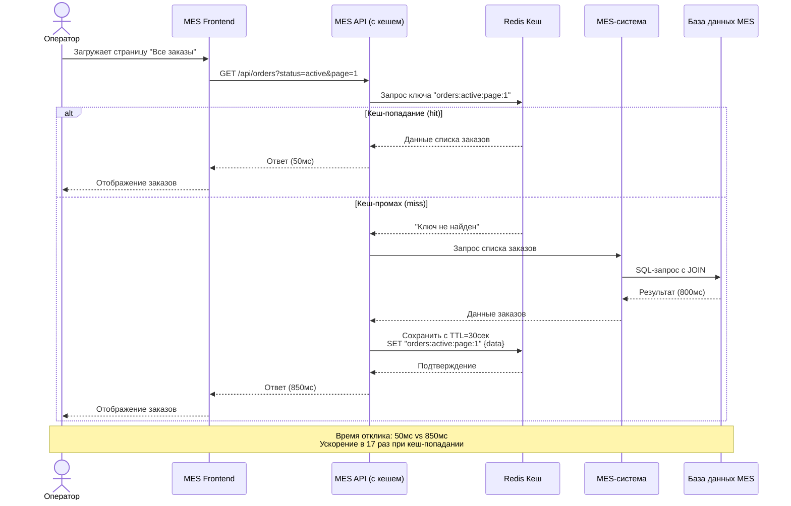
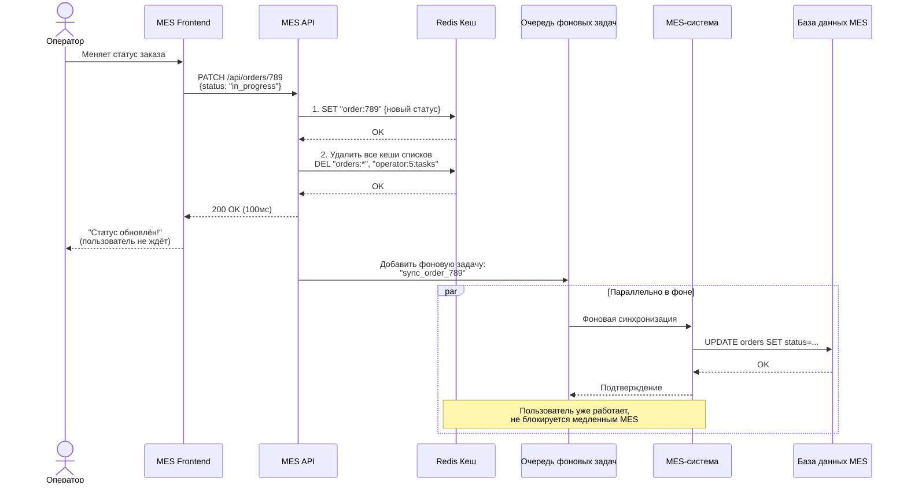
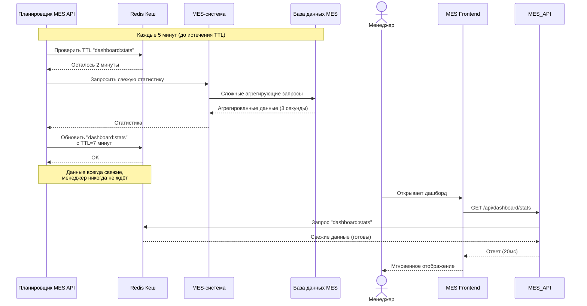

# Архитектурное решение по внедрению кеширования для оптимизации подсистемы MES

**Существуют следующие «горячие» точки для кеширования:**

1. **MES Frontend + MES API**:

**Проблема**: Низкая скорость работы страниц для операторов.
**Объект кеширования**: Часто запрашиваемые и относительно статичные данные, необходимые для отображения интерфейса и работы с ним. Например:

    * Список операторов с их текущей загрузкой (статус, кол-во активных заказов).

    * Справочники: типы изделий, статусы заказов, материалы.
    
    * Список заказов с фильтрацией и пагинацией (основной кандидат). Данные меняются не каждую секунду (новый заказ, изменение статуса), но запрашиваются постоянно при обновлении страницы оператором.

2. **Интернет-магазин (Internet Shop + Shop API)**:

**Проблема**: Новых клиентов не устраивает скорость выполнения заказа (вероятно, речь о получении статуса, расчете цены или просто общей отзывчивости).
**Объект кеширования**:
    * Статусы заказов для конкретного клиента. Часто опрашиваются клиентом, но меняются относительно редко (раз в несколько часов/дней).

    * Каталог изделий/услуг с базовыми ценами. Статичные данные, не меняющиеся ежедневно.

    * Результаты расчета цены. Расчет может быть тяжелым (зависит от 3D-модели). Можно кешировать результат по хэшу входных параметров (модель, материал, сложность) на короткое время (например, 10 минут), чтобы пользователь мог вернуться к расчету без повторной долгой обработки.

**Важный вывод**: Основная боль — подсистема MES. Чтобы снизить нагрузку на ее API и ускорить отклик для операторов, кеширование нужно внедрять перед MES API, т.е. на стороне потребителей его данных (MES Frontend) или в виде промежуточного прокси-кеша.

## Мотивация

### Почему нужно внедрить кеширование

1. Устранение «узкого горла»: API для проприетарной MES, является самой медленной и частью системы, даже наличие исходного кода не сильно облегчает задачу. Кеширование разгрузит его, перенаправив повторяющиеся запросы на чтение в быстрый слой, что напрямую решит проблему низкой скорости страниц для операторов.

2. Повышение отзывчивости UI: Данные для интерфейса MES (списки заказов, справочники) будут доставляться в разы быстрее, что улучшит опыт работы операторов и их производительность.

3. Косвенное ускорение выполнения заказа для клиента: Разгрузка MES API позволит ему эффективнее обрабатывать именно запросы на запись (изменение статусов), которые критичны для продвижения заказа по этапам. Это может положительно повлиять на общее время выполнения.

4. Повышение отказоустойчивости: При кратковременных сбоях MES API интерфейс оператора сможет какое-то время показывать актуальные (на момент последнего успешного запроса) данные из кеша, а не «падать» полностью.

### Какие элементы системы планируется включить в кеширование (приоритетный список)

1. GET /api/orders (и его вариации с фильтрами) из MES API → для MES Frontend.
2. GET /api/operators (список с метаданными) из MES API → для MES Frontend.
3. GET /api/orders/{id}/status из MES API или Shop API → для Internet Shop (личный кабинет клиента).
4. Результаты тяжелых вычислений (расчет цены) в Shop API.

## Предлагаемое решение

### Выбор стратегии кеширования

|Тип данных|Стратегия |Почему эта стратегия|Альтернативы и почему не подходят|
|-|-|-|-|
Справочники (операторы, типы)|Write-Through + долгий TTL|Данные меняются редко (раз в неделю/месяц). Write-Through гарантирует консистентность при редких обновлениях.|Cache-Aside: избыточные запросы к MES; Write-Behind: не нужно для редко меняющихся данных
Списки заказов|Cache-Aside + инвалидация по событиям|Часто читаются, регулярно обновляются. Инвалидация при любом изменении заказа обеспечивает актуальность.|Write-Through: слишком много записей; Write-Behind: сложно отслеживать все изменения
Статусы заказов|Write-Behind + короткий TTL|Критична скорость отклика UI. Оператор видит изменение мгновенно, синхронизация с MES в фоне.|Write-Through: блокирует UI; Cache-Aside: может показывать устаревшие данные
Дашборды/статистика|Refresh-Ahead + TTL|Тяжёлые запросы, требуют агрегации. Данные предварительно готовятся для мгновенного доступа.|Cache-Aside: пользователь ждёт расчёта; Write-Through: не применяется для read-only данных
Результаты расчёта цены|Cache-Aside + TTL на основе хеша|Дорогие вычисления, одинаковые входные данные дают одинаковый результат.|Write-Through: не имеет смысла для вычислений; Write-Behind: не применяется

**Технологический стек:**

1. Кеш первого уровня: Redis для быстрого доступа в памяти

    * Поддерживает TTL, pub/sub для инвалидации, кластеризацию

    * Интеграция с MES API через клиентскую библиотеку

2. Кеш второго уровня (опционально): PostgreSQL + материализованные представления для сложных агрегаций

3. Инструменты мониторинга:

    * Redis Metrics → Prometheus → Grafana

    * Кастомные метрики hit/miss ratio в MES API

### Диаграммы последовательностей

**Диаграмма 1: Чтение списка заказов (Cache-Aside)**

**Диаграмма 2: Изменение статуса заказа (Write-Behind + инвалидация)**

**Диаграмма 3: Автоматическое обновление дашборда (Refresh-Ahead)**

### Стратегия инвалидации кеша

**Стратегия инвалидации кеша**

Многоуровневая стратегия инвалидации:

1. Временная инвалидация (TTL) — базовый уровень

    * Для чего: Защита от "залипания" устаревших данных
    * Как работает: Автоматическое удаление по истечении времени
    * Применение:
        * Списки заказов: TTL = 30 секунд
        * Справочники: TTL = 24 часа
        * Статистика: TTL = 7 минут (с Refresh-Ahead за 2 минуты до истечения)

2. Программная инвалидация по ключу — основной механизм

    * Для чего: Гарантированная актуальность при изменениях
    * Как работает: MES API явно удаляет ключи при бизнес-событиях
    * Примеры событий:
        * Изменение статуса заказа → удалить order:{id}, orders:*
        * Назначение оператора → удалить operator:{id}:tasks, orders:assigned:*
        * Создание заказа → удалить orders:new:*, dashboard:stats

3. Инвалидация по шаблонам

    * Для чего: Когда неизвестны все конкретные ключи
    * Как работает: Удаление всех ключей по маске
    * Реализация: Redis команды SCAN + DEL или EVAL с Lua-скриптом
    * Пример: DEL orders:* (все кешированные списки заказов)

4. Инвалидация по событиям MES-системы

    * Для чего: На случай прямых изменений в MES-системе
    * Как работает: MES API подписывается на события/журналы MES
    * Пример: Изменение в таблице orders → MES API получает событие → инвалидация кеша

**Сравнение стратегий инвалидации:**

Стратегия|Что позволяет|Что НЕ позволяет| Когда использовать
|-|-|-|-|
TTL (временная)|Автоматическая очистка устаревших данных; Простая реализация|Не гарантирует актуальность; Данные могут устареть раньше TTL|Для данных, толерантных к небольшой задержке; Как страховочный механизм
По ключу|Точечная инвалидация; Максимальная актуальность|Требует знания всех зависимостей ключей; Легко пропустить какой-то ключ|Для критичных бизнес-данных (статусы заказов)
По шаблонам|Инвалидация групп связанных данных; Не нужно знать все ключи|Медленнее точечной; Может удалить лишнее|Для связанных наборов данных (все списки заказов)
По событиям|Реакция на изменения в источнике; Слабая связанность|Зависит от возможностей источника данных; Задержка событий|Для интеграции со сторонними системами

**Резюме решения**

Что внедряем:

1. Встроенный Redis-кеш в MES API с гибридными стратегиями:
    * Cache-Aside для списков
    * Write-Behind для изменений статусов
    * Refresh-Ahead для дашбордов

2. Многоуровневую инвалидацию:
    * Программная по ключам + шаблонам
    * TTL как страховка
    * Подписка на события MES

3. Мониторинг и управление:
    * Метрики hit/miss ratio
    * Автоматическое очищение устаревших данных
    * Алертинг при падении эффективности кеша
